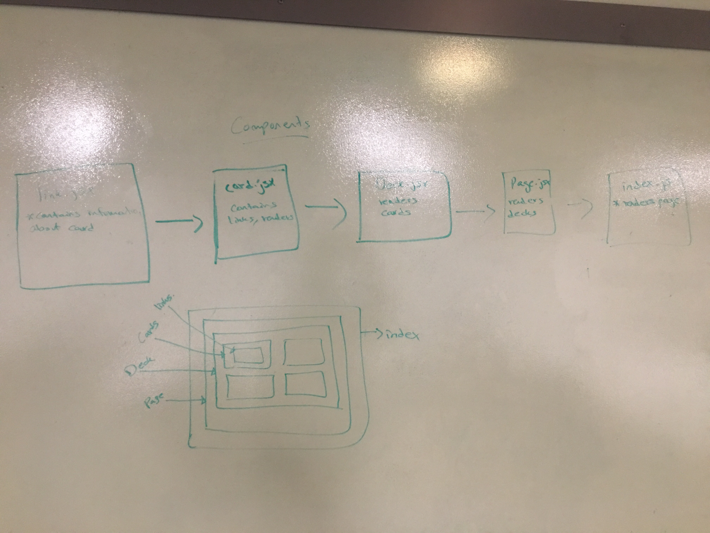

# Lab-29-Routing

### Author: Hanna ALemu

### Common npm Scripts
 "lint": "eslint \"**/*.js\"",  
   "start": "node index.js",  
   "test": "jest --verbose --coverage",  
   "test-watch": "jest --watchAll --verbose --coverage",  
  
### Links and Resources
* [submission PR](http://xyz.com)
* [travis](http://xyz.com)
* [Heroku]()

#### Documetnation

### Setup
$ run npm start

#### Running the app
* `npm start`

#### Tests
$ npm run test

#### UML
